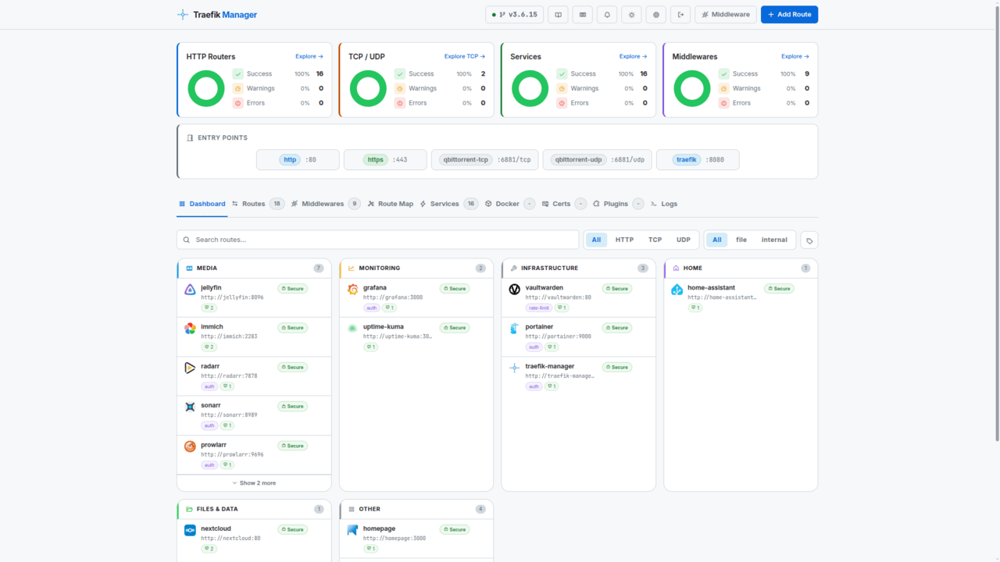

<div align="center">


# Traefik Manager

**A clean, self-hosted web UI for managing your Traefik reverse proxy.**

Add routes, manage middlewares, monitor services, and view TLS certificates - all without touching a YAML file by hand.

[](https://github.com/chr0nzz/traefik-manager/releases)
[](https://github.com/chr0nzz/traefik-manager/actions/workflows/docker.yml)
[](https://github.com/chr0nzz/traefik-manager/pkgs/container/traefik-manager)
[](https://github.com/chr0nzz/traefik-manager/pkgs/container/traefik-manager)
[](https://github.com/chr0nzz/traefik-manager/commits/dev)
[](LICENSE)
[](https://traefik-manager.xyzlab.dev/)

[](https://github.com/chr0nzz/traefik-manager/stargazers)
[](https://github.com/chr0nzz/traefik-manager/issues)
[](https://github.com/chr0nzz/traefik-manager-mobile)
[](https://play.google.com/store/apps/details?id=dev.chr0nzz.traefikmanager)
[](https://play.google.com/store/apps/details?id=dev.chr0nzz.traefikmanager)
[](https://ko-fi.com/chr0nzz)

</div>
<div align="center">
<sub>Built for homelabbers who love Traefik but hate editing YAML at 2am.</sub>
</div>

---

## Highlights

- **Routes** - add, edit, clone, and enable/disable HTTP, TCP, and UDP routes from the browser
- **Middlewares** - 24 guided wizards plus a raw YAML editor, for HTTP and TCP
- **Multi-server** - manage unlimited remote Traefik instances through a lightweight Go agent
- **Static config editor** - edit the full `traefik.yml` from the UI; Traefik restarts automatically
- **Backups** - timestamped local backups plus git push with history, diffs, and one-click restore
- **Monitoring** - live services, certificates, access logs, CrowdSec, and CVE advisory warnings
- **Mobile app** - Android companion app on Google Play

## Quick Start

**One-liner installer** - installs Traefik + Traefik Manager together, or Traefik Manager on its own via Docker or a native Linux service:

```bash
curl -fsSL https://get-traefik.xyzlab.dev | bash
```

**Manual Docker Compose:**

```yaml
services:
  traefik-manager:
    image: ghcr.io/chr0nzz/traefik-manager:latest
    container_name: traefik-manager
    restart: unless-stopped
    ports:
      - "5000:5000"
    environment:
      - COOKIE_SECURE=false
    volumes:
      - /path/to/traefik/dynamic.yml:/app/config/dynamic.yml
      - /path/to/traefik-manager/config:/app/config
      - /path/to/traefik-manager/backups:/app/backups
```

```bash
docker compose up -d
```

Open **http://your-server:5000** - the setup wizard will guide you through the rest.

---

## Screenshots

<p align="center">
<a href="https://traefik-manager.xyzlab.dev/ui-examples.html"><picture>
  <source media="(prefers-color-scheme: dark)" srcset="docs/public/images/readme-carousel-dark.gif">
  
</picture></a>
</p>

---

## Features

### Routes

- Add, edit, clone, delete, and enable/disable **HTTP, TCP, and UDP** routes
- **Multiple domains per route** with a chip builder, or switch to the **advanced rule editor** for complex expressions (`PathPrefix`, `HostRegexp`, `&&` / `||`)
- **Per-route certificate resolver** - pick any configured resolver, request **wildcard certificates**, or disable TLS
- **TLS options profiles** - create named `tls.options` (min/max version, ciphers, mTLS, SNI strict) and assign them per route
- **insecureSkipVerify per service** for backends with self-signed certs (Proxmox, Kasm, etc.)
- **Multi-config file support** - mount several dynamic files via `CONFIG_DIR` / `CONFIG_PATHS`, choose the target file per route, create new files from the UI
- Optional **app icons** on route cards and lists, shared with the Dashboard tab

### Middlewares

- **24 guided wizards**: Basic/Digest Auth, Forward Auth (with Authentik, Authelia, and Gatekeeper presets), OIDC Auth, Rate Limit, In-Flight Requests, IP Allowlist, Secure Headers, CORS, Redirects, Strip/Add/Replace Prefix, Retry, Circuit Breaker, Buffering, Compress, Chain, Encoded Characters, and more
- **Raw YAML editor** for anything the wizards don't cover
- **TCP middlewares** alongside HTTP
- **Provider middlewares** (Docker, Kubernetes, etc.) shown read-only in the provider tabs

### Live Dashboard & Monitoring

- Real-time stats: router counts, service health, entrypoints, Traefik version
- **Provider tabs**: Docker, Kubernetes, Swarm, Nomad, ECS, Consul Catalog, Redis, etcd, Consul KV, ZooKeeper, HTTP, File - all API-based, no extra mounts
- **Traefik CVE advisory warnings** - flags known security advisories affecting your running Traefik version
- Optional tabs (toggle in Settings) - API-based, no mounts:
  - **Dashboard** - routes grouped by category with app icons from [selfh.st/icons](https://selfh.st/icons/) (cached locally), per-card name/icon/group overrides
  - **Route Map** - entry points, routes, middlewares, and services in a visual topology
  - **TLS Options** - create and manage named `tls.options` profiles, assignable per route
  - **CrowdSec** - decisions and alerts from a LAPI; ban, captcha, bypass, or unban IPs with one click
- Optional tabs that read a mounted file:
  - **Certs** *(mount `acme.json`)* - TLS certificates with expiry tracking
  - **Plugins** *(mount `traefik.yml`)* - view plugins declared in your static config, and **install new ones** by pasting the snippet from the plugin catalog - TM writes the static config, optionally creates the matching middleware, and prompts a restart
  - **Logs** *(mount the Traefik access log)* - parsed access log cards with full-detail panel
- **Configurable file paths** - set the `acme.json`, access log, and static config paths from **Settings → File Paths** without a container restart; UI settings override env vars
- Card/list view toggle on Routes, Middlewares, and Services

### Static Config Editor *(optional - mount `traefik.yml` read-write)*

- Edit every part of `traefik.yml` from the UI - **Entrypoints, Cert Resolvers, Plugins, API, Logging, and Providers** sections, plus a raw **Monaco** YAML editor for the full file
- Changes are staged, backed up, and Traefik is **restarted automatically** - via socket proxy (recommended), poison pill (no socket needed), or direct socket
- Full-screen reconnect overlay polls until Traefik is back up

### Backups

- **Timestamped backups** before every change, one-click restore, **configurable retention**
- **Git repository backup** - auto-push your config to GitHub, Gitea, Forgejo, GitLab, or any HTTPS remote; browse commit history, view side-by-side diffs, restore any commit, set custom commit messages

### Multi-Server (Agents)

- **Traefik Manager Agent (TMA)** - a lightweight Go daemon that runs next to Traefik on any remote server
- **Server switcher** in the nav bar - every tab (routes, services, middlewares, backups, logs) works against the active server
- Setup wizard generates a ready-to-paste Docker Compose or Docker Run command; API key shown once and stored encrypted
- Per-agent git backup; manage unlimited servers from one TM - no VPN or SSH required

### Notifications

- In-app notification center for logins, config saves, restarts, backups, and CrowdSec actions
- **Webhook forwarding** to Discord or ntfy, with a test button in Settings

### Security

- **bcrypt passwords** (cost 12), optional **TOTP 2FA**, session fixation protection, configurable inactivity timeout
- **OIDC / SSO** - Keycloak, Google, Authentik, or any OIDC provider; restrict by email or group; can run as the **sole login method** with built-in auth disabled
- **Per-device API keys** (up to 10, individually revocable) - the mobile app keeps working in every auth mode
- CSRF protection, rate limiting, SSRF and git-transport hardening, secrets encrypted at rest (Fernet), atomic config writes
- See the [security](https://traefik-manager.xyzlab.dev/security.html) and [Traefik hardening](https://traefik-manager.xyzlab.dev/hardening.html) docs

---

## Deployment

| Runtime                                                                                                              | Guide                                                                                                                 |
| ----------------------------------------------------------------------------------------------------------------------| -----------------------------------------------------------------------------------------------------------------------|
|  Installer | [One-liner: full stack, TM-only Docker, TM-only Linux service, Agent](https://traefik-manager.xyzlab.dev/traefik-stack.html) |
|  Docker              | [Docker Compose setup, networking, behind Traefik](https://traefik-manager.xyzlab.dev/docker.html)                    |
|  Podman              | [Rootless, Quadlet/systemd, SELinux labels](https://traefik-manager.xyzlab.dev/podman.html)                           |
|  Linux                | [Native Python + systemd, no container required](https://traefik-manager.xyzlab.dev/linux.html)                       |
|  Unraid              | [Community Applications template, networking, multi-config](https://traefik-manager.xyzlab.dev/unraid.html)           |
| <i>Agent</i>                                                                                                         | [TMA - remote agent for multi-server management](https://traefik-manager.xyzlab.dev/agent.html)                       |

---

## Documentation

Full documentation at **[traefik-manager.xyzlab.dev](https://traefik-manager.xyzlab.dev/)**

|                                                                           |                                                       |
| ---------------------------------------------------------------------------| -------------------------------------------------------|
| [Get Started](https://traefik-manager.xyzlab.dev/guide.html)              | Deployment guides for Docker, Podman, and Linux       |
| [Traefik Stack](https://traefik-manager.xyzlab.dev/traefik-stack.html)    | One-liner installer guide                             |
| [Configuration](https://traefik-manager.xyzlab.dev/manager-yml.html)      | `manager.yml` reference                               |
| [Environment Variables](https://traefik-manager.xyzlab.dev/env-vars.html) | `CONFIG_DIR`, `CONFIG_PATHS`, auth, domains, and more |
| [Security](https://traefik-manager.xyzlab.dev/security.html)              | API keys, sessions, CSRF, rate limits, and hardening  |
| [Traefik Hardening](https://traefik-manager.xyzlab.dev/hardening.html)    | CVE advisories, header aliases, forwardAuth limits    |
| [API Reference](https://traefik-manager.xyzlab.dev/api.html)              | REST API for integrations and the mobile app          |
| [OIDC / SSO](https://traefik-manager.xyzlab.dev/oidc.html)                | OIDC setup, provider examples, and access control     |
| [Git Repository Backup](https://traefik-manager.xyzlab.dev/git-backup.html) | Auto-push, commit history, diff viewer, and one-click restore |
| [Mobile App](https://traefik-manager.xyzlab.dev/mobile.html)              | Android companion app setup and features              |
| [Reset Password](https://traefik-manager.xyzlab.dev/reset-password.html)  | CLI reset, TOTP recovery, manual reset                |
| [UI Examples](https://traefik-manager.xyzlab.dev/ui-examples.html)        | Screenshots and walkthroughs                          |
| [Provider Tabs](https://traefik-manager.xyzlab.dev/tab-docker.html)       | Docker, Kubernetes, Swarm, Nomad, ECS, and more       |

---

## Mobile App

**traefik-manager-mobile** is a React Native companion app for managing Traefik Manager from your phone. Requires **Traefik Manager v1.0.0 or higher**.

|          |                                                                                                |
| ----------| ------------------------------------------------------------------------------------------------|
| Repo     | [github.com/chr0nzz/traefik-manager-mobile](https://github.com/chr0nzz/traefik-manager-mobile) |
| Download | [Latest release](https://github.com/chr0nzz/traefik-manager-mobile/releases/latest)            |
| Auth     | Per-device API key - generate one in **Settings → Authentication → App / Mobile API Keys**     |

<a href="https://play.google.com/store/apps/details?id=dev.chr0nzz.traefikmanager">
  
</a>

Features: browse routes, middlewares, and services · enable/disable routes · add and edit routes and middlewares with guided wizards · multiple domains per route · per-service insecureSkipVerify · multi-config file picker · edit mode for bulk actions · CrowdSec tab · system light/dark theme.

---

## Tech Stack

| Layer     | Technology                                    |
| -----------| -----------------------------------------------|
| Backend   | Python 3.11 · Flask · Gunicorn                |
| Agent     | Go 1.23 · Alpine Linux (TMA - remote agent daemon) |
| Config    | ruamel.yaml (preserves comments)              |
| Auth      | bcrypt · pyotp (TOTP) · Flask sessions · CSRF · Flask-Limiter · Fernet |
| Frontend  | Vanilla JS · Tailwind CSS · Phosphor Icons    |
| Editor    | Monaco Editor (VS Code engine)                |
| Route Map | dagre (graph layout)                          |
| Container | Docker · Alpine Linux · all JS/CSS dependencies bundled at build time (no CDN at runtime) |

---

## Contributing

Pull requests are welcome. See [CONTRIBUTING.md](CONTRIBUTING.md) for how to report bugs, suggest features, and run the project locally.

## License

[GPL-3.0](LICENSE)
